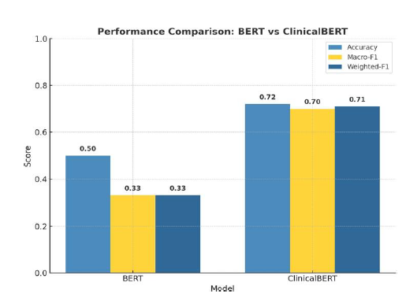

# Comparing ClinicalBERT and BERT for Hospital Admission Classification

This project compares the performance of ClinicalBERT and BERT for classifying clinical admission records. By fine-tuning transformer-based models on structured and unstructured hospital admission data, the study demonstrates how domain-specific pretraining significantly improves performance on healthcare NLP tasks.

A full project report is included:

📄 Comparing ClinicalBERT and BERT for Hospital Admission Classification.pdf

---

## 📌 Project Objective

Hospitals generate large amounts of unstructured clinical text such as admission notes, diagnoses, and discharge summaries. Traditional analytical tools struggle to extract meaningful insights from this data.

This project addresses:

**Automatic classification of hospital admission records using transformer models.**

We compare:

- **BERT** — general-purpose transformer  
- **ClinicalBERT** — domain-adapted transformer trained on biomedical & clinical notes  

---

## 🧠 Why ClinicalBERT?

BERT is trained on Wikipedia + BookCorpus, which lacks clinical terminology.

ClinicalBERT is trained on:

- Biomedical literature  
- MIMIC-III clinical notes  

Making it better at:

- Understanding medical terminology  
- Capturing clinical context  
- Handling shorthand used in hospital documentation  

---

---

## 📊 Dataset

The dataset contains de-identified hospital admission records with:

- Admission Type  
- Admission Location  
- Discharge Location  
- Diagnosis (text)

These fields are concatenated into one clinical narrative.

Labels: **Binary (0/1)**  
Split: **80% Train / 10% Validation / 10% Test**

⚠️ Dataset is not included for privacy reasons.

---

## ⚙️ Methodology

### 1. Preprocessing
- Combine selected fields → one text sequence  
- Clean labels (0 or 1)  
- Stratified splitting  

### 2. Tokenization
- Using HuggingFace AutoTokenizer  
- `MAX_LEN = 256`  
- Long texts → split into chunks  

### 3. Chunk Aggregation
\[
P_{\text{doc}} = \frac{\max(P) + \text{mean}(P)\cdot (n/2)}{1 + (n/2)}
\]

### 4. Training Setup
- PyTorch + Transformers  
- AdamW, LR = 2e-5  
- Batch size = 16  
- Epochs = 2  
- Warmup = 10%  
- Mixed precision (if GPU)  

### 5. Evaluation Metrics
- Accuracy  
- Macro F1  
- Weighted F1  

---

## 📈 Results

### Performance Comparison

| Model        | Accuracy | Macro F1 | Weighted F1 |
|-------------|----------|-----------|--------------|
| BERT        | 0.50     | 0.33       | 0.33          |
| ClinicalBERT| 0.72     | 0.70       | 0.71          |

### Visualization



ClinicalBERT outperforms BERT across all metrics.

---

## 🛠️ Installation

```bash
git clone https://github.com/mdemrannazirefty/ClinicalBERT-vs-BERT-Admission-Classification.git
cd ClinicalBERT-vs-BERT-Admission-Classification
pip install -r requirements.txt
```
Run the notebook:
```
jupyter notebook clinicalbert_vs_bert_admission_classification.ipynb
```
---
# 📊 Result Overview


---
# 🧑‍💻 Author

Md. Emran Nazir Efty

📧 mdemrannazirefty@gmail.com

🌐 https://www.linkedin.com/in/mdemrannazirefty

📍 Dhaka, Bangladesh
